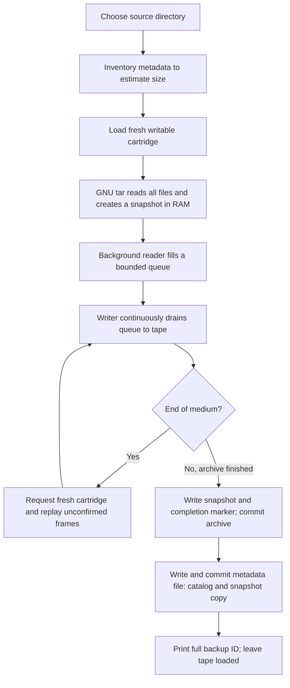
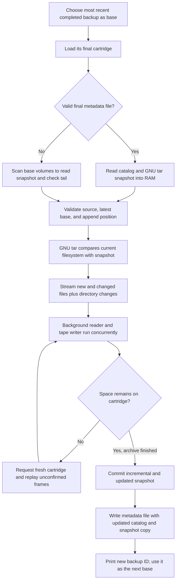

# Tape backup and restore

`tape-backup` streams full and incremental GNU tar archives or native ZFS send
streams between a local/SSH source and a Linux tape drive. It requires **no `--state`
directory, no disk copy of the archive, and no external restore catalog**.
Checksums, backup-chain identifiers, completion information, and the incremental
snapshot are carried on the tapes.

Incrementals **always append** to the base backup's final cartridge, continuing
onto blank media when needed. No `--append` flag is required. A separate metadata file at the end of a completed
backup stores a cartridge catalog and a copy of its GNU tar snapshot or ZFS
snapshot identity. No cartridge
MAM storage or persistent local manifest is required.

File backups and restores print file names. Streaming operations report transfer
totals, current and average MiB/s, elapsed time, and an approximate ETA.
`/dev/nst0` is the default; use `--device`
to select another non-rewinding tape drive.

## Current executable

Version **2.0.1** includes native ZFS streaming, file/folder exclusions, safer tape
handling, clearer help, and drive diagnostics. It fixes shared restore locking,
unnecessary continuation scans, and exclusion matching, and improves terminal
progress and information displays. Existing format-3 tar backups
remain readable. Update both machines when using SSH; transport version 3 prevents
older helpers from silently ignoring exclusion or ZFS options.

Download the executable and checksum from the
[v2.0.1 release](https://github.com/lbadger/tape-backup/releases/tag/v2.0.1), or
build from the current source checkout using Docker:

```bash
./build.sh
./dist/tape-backup --version  # tape-backup 2.0.1
(cd dist && sha256sum --check tape-backup.sha256)
```

Copy `dist/tape-backup` to the tape host. The historical
[v1.0.0 release](https://github.com/lbadger/tape-backup/releases/tag/v1.0.0)
does not implement automatic appending and must not be used with these incremental
instructions. Use the v2 executable for the commands documented here.

The local binary is Linux x86-64, built against glibc 2.31. It embeds Python;
Python and Docker are not required at runtime. Install GNU tar and `mt` from
`mt-st` (`sudo apt install tar mt-st` on Debian/Ubuntu). Normal Linux runtime
libraries, including glibc and zlib, are required. Alpine/musl needs a separate
build. Running the source script requires Python 3.11+.

Use a Linux SCSI tape drive supporting variable-length 64 KiB records. The user
must have permission to operate the device. The script disables immediate rewind
and filemark modes, plus kernel asynchronous writes, when necessary; changing
those driver settings may require root. It also enables `scsi2logical` so tape
position queries and seeks use logical block addresses. Run it with exclusive access to the drive.
Shared locks under `/run/lock/tape-backup-drive-*.lock` prevent competing v2 jobs
across accounts and tape-mode aliases. They cannot exclude unrelated tape programs.
The lock directory must be available and writable for initial lock creation.
Restore destinations also use shared `/run/lock/tape-backup-restore-*.lock`
files. Commands with different `$HOME` values or different tape drives cannot
restore to the same destination path concurrently. These persistent lock files
are released by closing the descriptor; do not delete them while jobs run.

Run `./tape-backup` for the command menu and examples, or
`./tape-backup help backup` for a command's options. File backups use `backup` and
`restore`; native ZFS uses `zfs-backup` and `zfs-restore`. `inspect` lists backup
IDs, `list` lists tar members, and `verify` reads every volume to check integrity.

## Full backup

```bash
./tape-backup backup --source /opt/audiobooks --level full --device /dev/nst0
```

There is no `--state` argument. The script inventories file metadata to estimate
size, loads a tape, and starts GNU tar with its output piped to the tape writer.
Source file contents are never staged on disk. A successful command prints the
backup ID on stdout; progress and file names go to stderr. Label every cartridge
with that ID and the volume number shown in the prompt.

**A new full backup requires a blank first cartridge.** Use the explicit `wipe`
command to initialize previously used media before starting a full. Incrementals always validate the existing tail and write
after recorded data. Every continuation cartridge must be blank; recorded or
unreadable cartridges are refused before any write, even after a tape-change prompt.
Inserting a recorded continuation tape repeats the request for the same volume
without ending the backup. Buffered data and the local or SSH source stream stay
active. Load a blank cartridge, or type `q` to cancel. Previously used continuation
tapes must be deliberately initialized with [`wipe`](#initialize-a-tape-for-reuse)
before reuse; backup never erases them automatically.
Other drive errors or failures after writing begins still stop the operation when
they cannot be recovered safely.
Every backup has its own ID and volume numbers, even when sharing a cartridge.



The reader and writer run concurrently. The metadata file is written after the
archive is committed; its failure handling is described [below](#on-tape-metadata).

Normal backups continue until the drive reports end of medium. For a shorter
multi-tape trial, use the [hidden test capacity option](#test-multiple-physical-tapes).

Use a filesystem snapshot or quiesce applications while backing up. GNU tar errors,
including changed/unreadable files, prevent writing the final completion marker.
This tool does not establish database or application consistency. It includes
mounted directories beneath the source and does not follow symlinks.

## Incremental backups

An incremental uses the GNU tar snapshot from the previous **completed** backup.
The snapshot is loaded from tape into RAM; no local `.snar` file is needed.
For a linear chain, always use the most recent successful backup ID as `--base`.

To use the remaining space on the base backup's final cartridge:

```bash
./tape-backup backup --source /opt/audiobooks --level incremental \
  --base PREVIOUS_BACKUP_ID --device /dev/nst0
```

Load the base's **final cartridge** at the append prompt. A valid final metadata
file supplies the snapshot without reading through the archive. For an existing
v1.0.0 backup without that file, the first append reads the base's volumes in
order to recover its snapshot and check the recorded tail. This can take as long
as traversing the base on a physical drive. Subsequent completed backups write
the metadata file for faster lookup; tape positioning still takes time.

Append requires the base to be the last completed backup on that cartridge.
The source directory and any SSH host/account must match. An incomplete or
unrecognized tail is refused. Existing backup records are retained. During
streaming, running out of space prompts for a blank cartridge and continues the same
incremental on the next numbered volume. The application never ejects the tape.
If there is no room even for the initial header, the command stops. It never
rewinds the base for an overwrite or skips a numbered volume after a header error.



`--append` is accepted for compatibility with existing scripts and has no effect
on incremental behavior. There is no incremental overwrite mode.
All ancestors, beginning with the full backup, are required
to restore an incremental recovery point. A new full starts an independent chain.

### Exclude files and folders

```bash
./tape-backup backup --source /opt --level full \
  --exclude 'cache' --exclude 'config/private.env' --exclude '*.tmp'

./tape-backup backup --source /opt --level full \
  --exclude-from /root/backup-excludes.txt
```

Both options are repeatable and may be combined. Patterns are case-sensitive and
anchored at the source root: `cache` excludes `/opt/cache` and its descendants,
while `nested/cache` selects that specific nested directory. `*`, `?`, and bracket
patterns are supported; wildcards can match `/`, so `*.tmp` also excludes nested
temporary files. Quote patterns to prevent expansion by your shell. Use
source-relative paths, not `/opt/...` or `../...`.

Inventory follows GNU tar's matching rules, including POSIX character classes
such as `[[:digit:]]`, bracket negation, and backslash escapes. `cache\*` matches
a literal `cache*`; use `cache\\*` to match names beginning with a literal
backslash after `cache`. A bracket expression such as `[*]` also matches a literal
asterisk. Character classes follow the source host's locale in both stages.

Exclusion files contain one pattern per line. Empty lines are ignored; spaces and
`#` are literal, and lines are not shell commands or comments. These files are
read on the tape host even for SSH backups. The normalized policy is limited to
16 KiB, recorded on tape, and applied to inventory and archive creation.

Incrementals automatically inherit their parent's exclusions. If you supply
exclusion options explicitly, the complete resulting policy must match the
parent's; changing it requires a new full. Older backups without a policy mean
no exclusions. Restore needs no exclusion file. Rules affect new backups only;
they do not remove anything from previously recorded tapes.

### How changes are detected

GNU tar's `--listed-incremental` snapshot records directory contents and filesystem
metadata. Tar uses this snapshot, including timestamps, to select new and changed
files and record directory changes. Deleted files need no file payload; directory
records let an incremental restore remove them. Unchanged file contents are not
read just to decide whether to include them. Snapshot memory grows with the number
of filenames.

**There is no per-file content-hash manifest.** The SHA-256 checksums on archive
frames, the complete archive, and the snapshot detect corruption during reading;
they do not select files for incrementals. Change detection follows GNU tar's
metadata-based incremental semantics, not a byte-by-byte comparison against the
full backup. Each incremental compares against its selected base's snapshot,
which already reflects the preceding chain.

### On-tape metadata

Metadata lives in ordinary tape records. After committing a completed archive,
the writer adds a separate, checksummed metadata file containing:

- Backup IDs, volume numbers, and positions of backup segments on that cartridge.
- The latest backup's source, parent ID, completion summary, and checksums.
- A copy of its updated GNU tar snapshot for preparing the next append.

The archive also keeps its original snapshot and completion marker, so the
metadata file is a lookup aid rather than a new dependency for restoring it.
Older metadata files stay in place; each successful append adds a newer one.


This is a logical layout; filemarks separate committed tape files. If a backup
spans cartridges, its final metadata file is on the final cartridge and catalogs
segments on that cartridge. Label physical cartridges separately from backup
volume numbers: a full's volume 1 and an incremental's volume 1 can share a tape.

If a configured volume cap leaves insufficient room for metadata, the writer
omits that file and the next append scans the base. If writing the metadata file
fails after the archive was committed, a warning identifies that condition:
the completed archive remains available to restore/verify, but a partial tail
prevents further appends. Preserve that cartridge for restore; a new full backup
on separate media can start a new chain. The catalog
is limited to 64 MiB; snapshots are held in RAM. There is no MAM dependency.

## Native ZFS streaming

Use `zfs-backup` to stream an **existing filesystem snapshot** with `zfs send`.
It uses the same continuous writer, buffers, tape-change protection, and replay
checks as file backups. It does not create or destroy source snapshots.

```bash
./tape-backup zfs-backup --snapshot tank/books@full

# Keep the parent's source snapshot; --base identifies its backup on tape.
./tape-backup zfs-backup --snapshot tank/books@next --base PREVIOUS_BACKUP_ID

# Read a snapshot from a remote OpenZFS host.
./tape-backup zfs-backup --snapshot tank/books@full --ssh backup@fileserver \
  --remote-program /home/backup/tape-backup

# Preserve native encryption. Incrementals inherit this mode.
./tape-backup zfs-backup --snapshot tank/private@full --raw
```

The source host needs OpenZFS and permission to query snapshots and send streams.
The first implementation supports one filesystem dataset per backup, not recursive
child-dataset replication or zvols. Native streams include dataset properties;
ordinary sends use compressed records. Encrypted datasets require `--raw` so the
tool never silently writes a decrypted version to tape. Preserve the encryption
keys separately. Destination OpenZFS must support the stream's features.

Incrementals validate the original base snapshot GUID, dataset, SSH identity, and
send mode before writing. A deleted/recreated snapshot with the same name is not
the same base. Incrementals append to tape; source snapshots must remain available
until they are no longer needed as incremental bases. File exclusions apply to
`backup`, not native ZFS send streams.

Receive a full chain into a **new child dataset** whose parent already exists:

```bash
./tape-backup zfs-restore --backup FULL_ID DELTA_ID --dataset tank/recovered

# Or restore in separate steps:
./tape-backup zfs-restore --backup FULL_ID --dataset tank/recovered
./tape-backup zfs-restore --backup DELTA_ID --dataset tank/recovered
```

ZFS restore verifies every requested backup before receiving it, then reads it
again for `zfs receive`. Allow for two tape passes. It checks received snapshot
GUIDs, records the last completed backup in `org.tape-backup:restore`, and blocks
continuation after an incomplete receive. It never uses `zfs receive -F`, rolls
back an existing dataset, or overwrites an unrelated destination.

Received filesystems stay **read-only and unmounted**, with sharing disabled.
This also prevents reads from changing access times and invalidating a later
incremental receive. Keep that baseline unmodified between restore steps and
unmount it before the next step. When recovery is complete, mount deliberately:

```bash
# For an encrypted receive, load its key first when needed:
# zfs load-key tank/recovered
zfs set canmount=noauto mountpoint=/srv/recovered tank/recovered
zfs mount tank/recovered
# Only when no further incrementals will be applied here:
# zfs set readonly=off tank/recovered
```

`inspect` and `verify` support native ZFS backups. `list` is for tar members;
restore/mount a ZFS dataset to browse its files. An interrupted receive may leave
an incomplete dataset; use a separate destination to rebuild the full chain.
Tape-level verification checks framed bytes and completion, while a receive also
checks the native ZFS stream. See the official
[send](https://openzfs.github.io/openzfs-docs/man/master/8/zfs-send.8.html) and
[receive](https://openzfs.github.io/openzfs-docs/man/master/8/zfs-receive.8.html)
documentation for OpenZFS stream compatibility.

## Back up a remote source over SSH

Run the command on the **machine with the tape drive**. Install the same version
of `tape-backup` on the source machine, together with GNU tar. Both machines must
run Linux; use a binary built for each machine's architecture. Neither machine
needs Python when using the standalone binary. The tape host also needs the
OpenSSH client; the source must accept SSH connections.

For example, copy the binary to the source account's home directory:

```bash
scp ./tape-backup backup@fileserver:/home/backup/tape-backup
ssh backup@fileserver 'chmod +x /home/backup/tape-backup'

./tape-backup backup --ssh backup@fileserver \
  --remote-program /home/backup/tape-backup \
  --source /srv/data --level full --device /dev/nst0

./tape-backup backup --ssh backup@fileserver \
  --remote-program /home/backup/tape-backup \
  --source /srv/data --level incremental --base PREVIOUS_BACKUP_ID \
  --device /dev/nst0
```

If `tape-backup` is in the remote account's PATH, omit `--remote-program`. This
option is one executable path, not a shell command. `--source` must be an absolute
path on the remote machine. The SSH account must be able to read all source files
and metadata; the tool does not run sudo automatically.

Use SSH keys or an agent and establish the server's trusted host key before
starting. Backups use batch authentication and strict host-key checking, so an
unknown host or a password prompt fails before tape writing starts. Existing
OpenSSH configuration, including host aliases and jump hosts, is honored. Options
`--ssh-port 2222`, `--ssh-identity /path/to/key`, and `--ssh-config /path/to/config`
override connection settings. Keep the same `--ssh` host/account or alias and
`--ssh-port` setting throughout an incremental chain; the resolved source path
must also match.

The remote helper inventories metadata for ETA, runs GNU tar, and streams archive
chunks over SSH to the local tape writer. Previous and updated incremental
snapshots stay in RAM on both machines. No archive or state directory is staged
on either machine. Tape changes pause the stream through pipe backpressure;
memory use remains bounded by buffers and snapshot metadata rather than archive
size. Remote file names, errors, transfer rates, and ETA appear in the local
terminal. SSH transport encrypts the network connection; tapes are not encrypted
by this tool.

An SSH disconnection or remote tar failure leaves an incomplete tape set that
cannot be used for restore or as an incremental base. Earlier completed backups
remain usable for restore, but a partial recorded tail blocks further appends.
Preserve those cartridges and start a new full on separate media if needed.
Restore uses the usual local
`restore` command below and requires no SSH access or original source machine.

## Restore directly from tape

Restore the full backup and incrementals together, or apply the incrementals in
later commands. They must be applied in parent order.

For a new destination, pass the full ID followed by every incremental ID to the
desired recovery point:

```bash
./tape-backup restore --backup FULL_ID DELTA_1_ID DELTA_2_ID \
  --destination /srv/recovered --device /dev/nst0
```

For a full-only restore, specify just the full ID. Tape headers contain the
metadata required for restore; the original machine, source directory, external
catalogs, and local incremental snapshots are unnecessary.

To restore one step at a time, use the same destination for each command:

```bash
./tape-backup restore --backup FULL_ID --destination /srv/recovered
./tape-backup restore --backup DELTA_1_ID --destination /srv/recovered
./tape-backup restore --backup DELTA_2_ID --destination /srv/recovered
```

You can also apply several remaining incrementals in one command:

```bash
./tape-backup restore --backup DELTA_1_ID DELTA_2_ID --destination /srv/recovered
```

Each successful restore records its latest backup ID in a small sibling file,
such as `/srv/.recovered.tape-restore.json`. It binds the backup's source identity
to that destination directory. This lets later commands reject skipped,
repeated, or unrelated incrementals. The file is outside the restored tree, so
tar's directory deletion records cannot remove it. It is local restore history,
not a backup catalog required to recover from the tapes.

**For a directory restored by an older executable**, supply the last backup ID
already applied there once:

```bash
./tape-backup restore --backup NEXT_DELTA_ID --base LAST_RESTORED_ID \
  --destination /srv/recovered
```

This asserts the existing directory's baseline. The application reads that
backup's header and validates the next incremental's parent/source; it does not
re-extract the full backup or compare all existing file contents. Subsequent
commands use the recorded history and need no `--base`. An untracked nonempty
directory is otherwise refused. Do not edit the restored tree between steps.

The reader locates each requested backup by ID, including later backups on a
shared cartridge. It reuses the loaded cartridge when it contains the next
requested segment, and prompts when another cartridge is needed. Keep every
cartridge in the chain, including any tapes where an incremental started before
continuing on another tape.

Restore validates each in-memory chunk before passing its archive bytes to GNU
tar. It applies additions, changes, deletions, and renames from the ordered chain.
A **new restore** requires an empty or absent destination. Files are extracted
into a private sibling directory and published only after the requested chain
has been verified. Its successful result can then receive further incrementals.

For an **existing restore**, requested incrementals are first read and verified
without changing files, then read again to apply in place. The full archive is
not read again, and no second copy of the directory or disk archive is created.
Each applied incremental is flushed and recorded separately. Files can be
changed or deleted according to the incremental archive.

An interrupted apply, extraction failure, or disk error can leave the existing
tree partly updated. Its history is marked incomplete before any changes begin;
later incrementals are refused until you rebuild the full chain into a separate
directory. `--base` cannot override an incomplete restore record. The preflight
verification catches existing tape corruption before changes, but is not a
rollback mechanism for failures during application.

The tape contains format-3 framing around the tar data, so a direct
`tar --extract --file=/dev/nst0` cannot restore it. If the standalone executable
is unavailable, run this repository's `tape_backup.py` with Python 3.11+, GNU tar,
and `mt` installed:

```bash
python3 tape_backup.py restore --backup FULL_ID DELTA_1_ID DELTA_2_ID \
  --destination /srv/recovered --device /dev/nst0
```

For a full-only restore, pass just the full backup ID. Keep a copy of the source
script or executable with your recovery tools.

**Restore writes extracted files and a small restore-history record, not a
reassembled tar archive.** For a new restore, allow
space for the largest intermediate directory tree in the chain, including files
later deleted by an incremental. Publication uses a rename, without copying the
restored tree. Permissions, timestamps, links, sparse files, ACLs, and extended
attributes are restored where supported; arbitrary ownership and privileged
metadata generally require root. Restore only trusted tape sets, especially as
root. Checksums detect corruption but are not signatures or encryption.

## Progress, transfer rates, and ETA

`backup` and `zfs-backup` accept `--json` for a completion summary with
`archive_complete`, `metadata_complete`, `append_ready`, `data_verified`, and
`warnings`. A metadata failure can leave a committed archive whose tail cannot
be appended to; `append_ready: null` reports that uncertainty. Without `--json`,
successful backups still print only their ID on stdout. `--verify` performs a
full read-back after backup; only successful verification sets `data_verified`
true. Verification failures return nonzero and identify the committed backup.

File names are printed by default. Progress is printed every five seconds and
at completion. Terminals show a block sized to the available width, for example:

```text
Backup 726246ca4cb4 | writing volume 1, chunk 382644
  Read 1,495.66 GiB  |  Delivered 1,494.70 GiB  |  Committed 1,494.25 GiB
  Buffer 1.00 GiB each  |  Queued 989.10 MiB  |  Recovery 479.40 MiB
  Source 176.0 MiB/s (reading)
  I/O 188.5 MiB/s  |  Average 162.4 MiB/s  |  Elapsed 02:39:30
  ETA ~00:00:06 (current archive)
```

The progress heading abbreviates the ID; the startup message and successful
backup result retain the full ID. Transfer counters use at most GiB so ordinary
progress remains visible on multi-terabyte archives. Redirected stderr retains
the compact log format. During the final tape commit and metadata write, ETA
shows `finalizing` until the command actually completes.

Backup status shows the configured buffer budget, queued payload bytes, recovery
bytes retained (including framing), and archive bytes confirmed on media. Each of
the read-ahead and recovery buffers has that budget; `--volume-size` can reduce
the recovery budget. The active writer frame and partly filled reader frame are
not included in the queued count.

During backup, bytes read update after each source read of up to 1 MiB, including
partially filled chunks. Source MiB/s measures archive bytes received from GNU tar
or SSH over the reporting interval; it excludes SSH framing and snapshot metadata.
The reader reports `reading`, `waiting (buffers full)`, or `finished` separately
from the writer's phase. `waiting for source` means the writer needs another
small frame; `flushing` identifies a volume boundary, backup completion, or a full
recovery buffer awaiting confirmation. A zero tape I/O rate alone does not
indicate whether source reads are still progressing.

I/O rates measure bytes passed to/from the device, including framing, padding,
and retries. They are host-side rates, not measurements of physical tape motion
or compressed media capacity. Delivered backup bytes have been accepted by the
writer; they may still be buffered in the drive. Committed bytes have been
confirmed on tape by READ POSITION or a synchronous filemark flush. Replay does
not double-count either logical counter. Restore delivery counts archive bytes
passed to GNU tar. The average includes elapsed media-change time.

The ETA estimates remaining time for the **current archive**, not later
incrementals in a restore chain. Backup estimates come from file metadata only;
restore uses that estimate from the tape header. Sparse files, incremental
selection, directory changes, media changes, and final flushing can affect its
accuracy. It starts as `calculating` and shows `finishing (estimate reached)` when
an underestimated archive is still running. No source contents are read merely
to calculate the estimate.

`--quiet` suppresses per-file output while retaining rates, ETA, summaries, and
errors. Large-file transfers still produce periodic status lines.
While waiting for a tape-change response or loader command, progress ticks pause
and file names/diagnostics from local tar and SSH wait behind the prompt. Logging
resumes after Enter is pressed or the loader returns. Child output uses bounded
pipes, so waiting does not accumulate an unbounded log in RAM or on disk.

## Bounded buffering and failure recovery

The default buffer budget is 1 GiB; adjust it with `--buffer-size`, between 64 KiB
and 10 GiB. For example:

```bash
./tape-backup backup --source /opt --level full --buffer-size 10GiB
```

The background reader feeds a bounded queue of small frames (normally 4 MiB),
while the writer drains it continuously. Writing starts with the first frame;
it does not wait for the entire buffer budget to fill. Free queue slots are
refilled individually during writes and tape changes. Whole-archive checksums
are updated incrementally; individual frames also carry checksums and chain links.

There is no synchronous filemark after every frame. On supported physical drives,
SCSI READ POSITION reports which records have reached the medium without flushing
the drive. Only complete frames below that position are released from the recovery
buffer. The accepted-write position is checked against our record count, and the
medium position must never move backwards. Kernel asynchronous writes are disabled
to keep these counts aligned; the drive buffering setting is preserved.

The writer commits at volume boundaries and backup completion. It also commits if
the recovery buffer fills before the drive confirms enough data. This fallback is
necessary when position reporting is unsupported, unavailable, inconsistent, or
the buffer is too small for the drive's unconfirmed tail. Linux SG_IO access may
require root/CAP_SYS_RAWIO. The startup log reports unavailable position tracking;
status identifies fallback flushes as `recovery buffer full`. File-backed media
uses the same fallback with fsync instead of hardware position reports. A source
that cannot keep up, media changes, and drive behavior can still cause pauses.

The source queue and recovery window each use up to the selected budget, plus a
few active frames, allocation overhead, Python/GNU tar memory, and incremental
snapshot metadata. Allow more than 2 GiB of RAM at the default, or more than 20 GiB
with a 10 GiB budget. Very small budgets still allow one active frame and one queued
frame, and at least 128 KiB of recovery framing. Allocation grows on demand.
The SSH source only needs small transport frames and its snapshot metadata.
Restore holds a small frame plus a bounded history of header digests.

On a short write, end-of-tape indication, or write/position I/O error, the writer
requests another tape and replays **every unconfirmed frame**, including the
partially written frame. Keep earlier volumes: they contain the confirmed prefix
and may also contain some or all of the replayed tail. Restore validates the chain
and each replayed header before suppressing duplicates, so several overlapping
frames across replacement volumes are safe. Repeated failures without confirmed
progress stop the job.

A final completion marker is written only after GNU tar exits successfully and
the new incremental snapshot has been recorded. Backup reports success only after
the final synchronous commit. Missing frames, wrong tapes, checksum failures, and
incomplete sets are rejected. Backup does not perform automatic read-back
verification; use `verify` for a full read pass.

Tar backups use **format 3**; native ZFS backups use **format 4** volume headers
with the same bounded frame/replay machinery. Update both ends of SSH backups
together; the current transport uses 64-bit version-3 packet framing.

See the [continuous-streaming design and validation plan](docs/continuous-streaming.md).

**A stopped/killed process or power failure can leave an incomplete tail that
blocks further appends.** There is no persistent byte-resume checkpoint or automatic
tail repair. Preserve completed backups for restore; start a new full backup on
separate media when the chain cannot be continued. Repeat
an interrupted restore from its first tape. Ordinary failures clean up the private
tree for a new restore; an interrupted in-place apply is marked incomplete.
After SIGKILL or power loss, an abandoned `.DEST.restoring-*` sibling
may remain and can be removed after confirming it belongs to that failed restore.

The executable itself extracts its bundled runtime into a temporary directory;
this is a small runtime footprint, not backup staging. A few fixed-size lock files
are also used. `TMPDIR` must support executable mappings and symlinks when running
the standalone executable.

## List files

```bash
# List the first backup on the loaded tape; no backup ID required.
./tape-backup list --device /dev/nst0

# List a particular full or incremental backup on a shared cartridge.
./tape-backup list --backup BACKUP_ID --device /dev/nst0

# Save the names; progress and tape prompts stay separate.
./tape-backup list --backup BACKUP_ID > files.txt
```

`list` prints archived file and directory names without extracting anything. It
reads the entire selected backup, checks all frame and completion checksums, and
requests its continuation tapes in order. Start with that backup's volume 1.
Listing can take as long as a verification pass; the cartridge catalog does not
contain a complete file list. Plain `tar -tf /dev/nst0` cannot decode this framed
tape format.

Names go to stdout, with special characters such as embedded newlines escaped
by GNU tar. Progress and diagnostics go to stderr. Output may be partial if the
command is interrupted, a cartridge is missing, or validation fails; only exit
status 0 indicates a completed listing. All output pauses during tape prompts.
The tape remains loaded.

Each invocation lists one archive. For an incremental, this shows archived
changes and directory entries, not the complete reconstructed filesystem or a
separate list of deletions. Use `inspect` to find backup IDs on a shared cartridge.

## Inspect and verify

```bash
# List every backup segment on the loaded cartridge, including incrementals.
./tape-backup inspect --device /dev/nst0

# Quickly read just the first backup header (the previous default).
./tape-backup inspect --first --device /dev/nst0

# Inspect a particular backup's first volume, possibly later on the same tape.
./tape-backup inspect --backup BACKUP_ID --device /dev/nst0

# info is an alias for inspect. Force a format when needed.
./tape-backup info --first --text
./tape-backup inspect --json > cartridge.json

# Read and verify every data chunk and the whole archive's checksum.
./tape-backup verify --backup BACKUP_ID --device /dev/nst0
```

In a terminal, `inspect` (also `info`) and `verify` show labeled, wrapped details
with complete IDs and an explicit data-verification state. `--json` selects
structured output; redirected stdout defaults to JSON to preserve scripts.
`--text` forces readable output even through a pipe. Partial listings still
return exit code 1 and show the entries found plus the failure reason.

The JSON output from plain `inspect` lists the full backup and appended incrementals in its `backups`
array. `--all` remains an optional alias for this default. Each entry includes its
ID, source, creation time, full/incremental level, parent ID, and volume number.
It lists segments on the loaded cartridge, including continuation segments;
it does not request other cartridges. With `--media-dir`, it lists all cartridge
files.

When the cartridge ends with a valid metadata catalog, inspection reads that
metadata and seeks directly to each indexed backup header. It validates the
catalog and header checksums without reading archive data. Entries report
`listing_method: "catalog"`; `completion_marker_present` is `null` because the
archive's completion record was not read. Loading, tape positioning, and metadata
reads still take time.

If the catalog is absent, incomplete, or unusable, physical-tape inspection reports
that a scan is required and exits nonzero. Run `inspect --scan` to permit the
sequential fallback, which can take substantially longer. File-backed media
retains automatic scanning. Entries report `listing_method: "scan"` and whether a completion marker was
encountered. An unreadable or partial tail is reported in `errors` with
`scan_complete: false`, while earlier headers remain listed. `scan_complete: true`
means listing finished without errors, whether by catalog lookup or scanning.
Incomplete inspection retains discovered entries in JSON and returns exit code 1.
Catalog lookup validates each indexed header once, avoids redundant positioning,
and hashes unneeded snapshot data without allocating another full RAM copy.

`inspect --first` reads only the first 64 KiB header from a backup's first
cartridge, preserving the previous quick ID-discovery behavior. It returns a
single object with `volume: 1` and `header_verified: true`, without reading the
archive or incremental snapshot.

All inspection modes leave `data_verified` and `completion_verified` false.
Readable headers, catalogs, and completion markers do not establish that an
entire backup is restorable. `verify` reads all volumes without extracting files
and reports `data_verified: true` only after validating the full stream and
completion record. Final archive sizes, checksums, and total volume counts come
from `verify`.

Selecting `--backup ID` can use the final catalog to seek to that backup's header;
without a usable catalog it scans preceding records. Use `verify --backup ID`
to validate the selected backup's full stream, rather than every backup on the
cartridge. For a recovery chain, verify each backup separately.

## Tape format

Tar backups use format 3 (`TAPE-STREAM-3`), including existing v1.0.0 backups.
Native ZFS uses format 4 (`TAPE-STREAM-4`) volume headers, so old readers reject
it before interpreting native payloads as tar. Formats 1 and 2 remain unsupported.

Appended backups are independent format-3 streams. The additional metadata file
has its own version (currently 1); existing archive headers are never rewritten.
Use the current executable or source for selecting appended backups; the older
v1.0.0 reader does not implement cartridge catalog lookup.

See the [append design and validation notes](docs/append-incrementals.md).

## Automated tape loading

`--media-command /absolute/path/to/loader` runs an executable with four arguments:

```text
write|read|append|blank  BACKUP_ID  VOLUME_NUMBER  DEVICE
```

The loader must load the requested cartridge, wait for readiness, and return zero.
Version 2 uses `blank` for the first cartridge of a new full and every empty
continuation cartridge, including when an
incremental cannot start under the configured size cap. The application checks
that no recorded data exists before writing. The loader must supply blank media
and must not erase a recorded cartridge to satisfy this request.
If the cartridge contains recorded data, the application closes it and repeats
the same `blank ID NUMBER DEVICE` request, retaining its buffers and source stream.
The loader should wait for a suitable cartridge or return a nonzero status to
cancel, rather than repeatedly returning the rejected tape.
Read requests also repeat when a readable cartridge does not contain the required
backup/volume. Accepted read progress is retained. Corrupt or unreadable media
still produces an error instead of silently retrying forever.
For `append`, load the
base backup's final cartridge and preserve its contents; the ID is the base ID
and the volume-number argument is `0` because its final volume is not yet known.
For ID discovery, the ID argument is `unknown-backup`. Plain `inspect` and `inspect --all` use
`read unknown-backup 0 DEVICE` to request a cartridge independently of a backup's
volume number. Update existing loaders to support these requests.
The command runs without a shell; prompts otherwise
use `/dev/tty`. The application closes the tape device before requesting another
cartridge but leaves the current cartridge loaded. The loader must handle any
unloading needed to change tapes.

## Initialize a tape for reuse

Load the cartridge you intend to erase, then run:

```bash
./tape-backup wipe --device /dev/nst0
```

**This destroys access to the existing backups on the loaded tape.** The command
names the device and requires typing `WIPE` before it changes the tape. For
unattended use, supply `--yes` to explicitly confirm the destructive operation:

```bash
./tape-backup wipe --device /dev/nst0 --yes
```

The default is short erase, intended to initialize the tape for reuse. It is
not a secure sanitization guarantee. Use `--long` to request a long erase, which
can take hours and may keep running in the drive after an interruption:

```bash
./tape-backup wipe --device /dev/nst0 --long
```

The implementation uses Linux's [short/long erase interface](https://www.kernel.org/doc/html/latest/scsi/st.html#ioctls).
It waits for the erase command, checks the result with the same blank-tape check
used by continuation backups, and leaves the tape rewound and loaded. It writes
no backup header or filemark. A failed erase or uncertain blank state is reported
as an error, not successful initialization. No automatic fallback to long erase
is performed. This operates on the drive's current tape partition; it does not
repartition media or certify erasure of other partitions or cartridge memory.

Prepare continuation tapes **before starting the backup**, or use another drive.
`wipe` takes the drive lock and refuses to run while a backup/restore holds it,
including while that job is waiting for another tape. Use the drive's eject
button to swap tapes at a prompt. `wipe` does not provide resume support for an
already exited backup.

## Drive status and diagnostics

```bash
./tape-backup status
./tape-backup doctor --device /dev/nst0
./tape-backup status --json
./tape-backup status --text | less
```

Both commands show aligned details in a terminal, including identity, readiness,
write-protection, compression, tape file/block, logical position, driver settings,
and I/O counters with readable units. Missing information says `Unknown`, rather
than implying compression is off or the tape is at block zero. `--json` selects
structured output; redirected stdout defaults to JSON. `--text` forces readable
output in a pipe. They
do not rewind, erase, eject, or change settings. Unsupported/unavailable fields
remain unknown with diagnostics. When another v2 command owns the shared drive
lock, only passive sysfs statistics are read. Counters describe host I/O, not
guaranteed remaining physical capacity.

## Hardware compression

```bash
./tape-backup compression status --device /dev/nst0
./tape-backup compression on --device /dev/nst0
./tape-backup compression off --device /dev/nst0
```

Omitting the action runs `status`; `/dev/nst0` is the default device. Status reads
the drive's current Data Compression mode page and reports `ON`, `OFF`, or
`UNSUPPORTED`. Setting compression uses the same Linux tape-driver operation as
`mt -f /dev/nst0 compression 1` or `compression 0`, then reads the setting back
before reporting success. An unreadable setting produces an error rather than
being reported as `OFF`. Direct SCSI queries may require root/CAP_SYS_RAWIO.

These commands do not rewind, erase, or eject the tape. They use the same drive
lock as backup/restore, so set compression before starting the job. Status reports
the drive's compression-enable setting, not the compression ratio achieved for
the data. This does not add software compression to the archive or rewrite
existing recordings. Drive configuration may reset the setting after media loads
or power cycles; the command does not change persistent driver defaults.

## Eject a tape

Tapes stay loaded after backup, restore, list, inspect, and verify, and at tape-change
prompts. The application never ejects automatically. When finished, eject explicitly:

```bash
./tape-backup eject --device /dev/nst0
```

This rewinds and unloads the selected drive; `/dev/nst0` is the default. It uses
the same drive lock as other commands and refuses to run while another job under
the same Unix account holds that lock, including while waiting for a tape change.
At a tape-change prompt, use the drive's eject button to replace the cartridge,
then press Enter. Every incremental retains the final base cartridge for writing
unless it needs a blank continuation cartridge. Pressing Enter at a continuation
prompt cannot authorize overwriting the still-loaded base tape.
If a recorded tape is inserted, the prompt repeats for the same volume. The
backup remains active until a blank cartridge is supplied or the operation is
cancelled. Once the process exits, replacing the cartridge cannot resume it;
the required streaming state existed only in RAM.

## Test multiple physical tapes

The optional `--volume-size` argument is hidden from normal `backup --help`.
It caps each physical cartridge for this backup, without changing the cartridge's
actual capacity. For example, treat each 2.5 TB cartridge as a 10 GiB volume:

```bash
./tape-backup backup --source /path/to/test-data --level full \
  --device /dev/nst0 --volume-size 10GiB
```

Use a small test source with about 25 GiB of actual, non-sparse file data to
exercise roughly three cartridges. The limit applies to each tape, **not to the
total source**; pointing at a multi-terabyte source still backs up that entire
source. The first cartridge and all continuation
cartridges must be blank. Initialize previously used test cartridges with `wipe`
before starting. Label them with the printed backup ID and volume numbers.

The writer commits and prompts for the next cartridge before exceeding the cap.
It counts formatted record bytes, including headers and padding, before drive
compression; filemarks and physical drive overhead are excluded. Existing records
count toward the cap when appending. The drive's real end-of-medium handling still
applies if reached sooner. This tests planned tape changes and multi-volume
restore; it does not reproduce every physical end-of-medium error.

After the backup completes, load volume 1 and verify or restore normally:

```bash
./tape-backup verify --backup BACKUP_ID --device /dev/nst0
./tape-backup restore --backup BACKUP_ID --destination /root/tape-test-restore \
  --device /dev/nst0
```

Verify and restore request each required volume without a capacity option. Omit
`--volume-size` on later backups to use normal tape capacity. The test option also
works with SSH sources and incrementals. Sizes accept integer bytes or `KiB`,
`MiB`, `GiB`, and `TiB`; the minimum is 256 KiB. Use `10000000000` for exactly
10 decimal GB, or `10GiB` for 10 binary GiB.

## File-backed testing and building

`--media-dir` uses files as simulated cartridges instead of a physical device.
It cannot be combined with `--device`. Its default volume cap is 1 GiB.

```bash
full_id=$(./tape-backup backup --source ./sample-data --media-dir ./demo-tapes \
  --volume-size 1MiB --buffer-size 256KiB)
./tape-backup restore --backup "$full_id" --media-dir ./demo-tapes \
  --destination ./demo-restored

# After changing files in sample-data, append an incremental.
delta_id=$(./tape-backup backup --source ./sample-data --media-dir ./demo-tapes \
  --level incremental --base "$full_id" --volume-size 1MiB \
  --buffer-size 256KiB)
./tape-backup inspect --media-dir ./demo-tapes
./tape-backup restore --backup "$full_id" "$delta_id" --media-dir ./demo-tapes \
  --destination ./demo-restored-latest

# Build a glibc 2.31 executable using Docker with BuildKit.
./build.sh

# Or build for the local Linux environment with Python 3.11+, pip 22.3+,
# the venv module, and binutils. The result inherits host library requirements.
./build.sh --local

# Test source code, SSH, and the built executable.
# SSH integration tests need ssh, ssh-keygen, and sshd (openssh-client/server).
TAPE_BACKUP_BINARY="$PWD/dist/tape-backup" python3 -m unittest discover -s tests -v

# Native ZFS integration tests require a dedicated, disposable scratch pool.
# Tests create and remove their own child datasets; never use a production pool.
sudo env TAPE_BACKUP_ZFS_TEST_POOL=my_scratch_pool \
  TAPE_BACKUP_BINARY="$PWD/dist/tape-backup" \
  python3 -m unittest discover -s tests -p test_zfs.py -v

# Optional 10 GiB streaming round trip (about 31 GiB disk and >20 GiB free RAM).
TMPDIR="$PWD" TAPE_BACKUP_BINARY="$PWD/dist/tape-backup" TAPE_BACKUP_LARGE_TEST=1 \
  python3 -m unittest discover -s tests -p test_binary.py -k full_10_gib -v

# Test in Debian 11 without Python installed.
docker run --rm --network none \
  -v "$PWD/dist:/opt/tape-backup:ro" \
  -v "$PWD/tests/binary_smoke.sh:/smoke.sh:ro" \
  debian:bullseye-slim sh /smoke.sh
```

Build output is `dist/tape-backup` and `dist/tape-backup.sha256`; only the executable
needs to be copied to another compatible system. `PYTHON=/path/to/python3` selects
the interpreter for `--local` builds. PyInstaller is isolated in `.venv-build`.

Tests cover streaming full and multiple incremental restores, no disk staging,
metadata, ETA/rates, end-of-medium rollover, short writes, synchronous flush
failures, lost buffered tails, duplicate replay, corruption, incomplete tapes,
same-cartridge appends, preservation of earlier records, metadata lookup,
interrupted tails, chain validation, SSH full/delta restores, host-key verification, remote failures,
connection loss, and standalone binaries at both ends. SSH tests launch a
temporary loopback server with isolated keys/configuration. Automated tape checks
use simulated media; qualify end-of-medium recovery and restore on your drive
and loader with scratch media before relying on them.

The [CI workflow](.github/workflows/test.yml) builds the executable, runs the
source/binary/SSH tests and the no-Python smoke test, and exercises native ZFS
full, incremental, stepwise, and encrypted raw restores on a scratch pool.
An archived fixture from v1.0.0 checks compatibility with released tar tapes.

Format 3 uses 64 KiB records with checksummed headers and payload frames up to
4 MiB. Frames share a tape file between explicit commits. Archive payloads are
GNU incremental tar streams; the surrounding framing is specific to this tool.
Use this script to restore these volumes, rather than invoking tar directly on
the device.

See the [project review and feature roadmap](docs/project-review-and-roadmap.md)
for proposed reliability, inspection, indexing, and recovery improvements.

See [GNU tar incremental semantics](https://www.gnu.org/software/tar/manual/html_node/Incremental-Dumps.html)
and the [Linux SCSI tape driver](https://www.kernel.org/doc/html/latest/scsi/st.html)
for the underlying archive and tape behavior.
