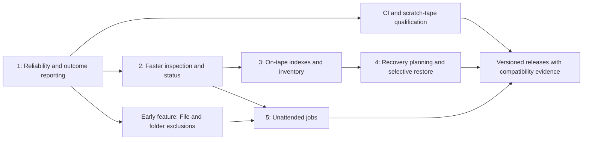

# Project review and feature roadmap

Reviewed 2026-09-24 against the working source and local `1.1.5-dev` executable.
This includes the uncommitted append, restore, media-management, and listing work;
it is not a review of the older published v1.0.0 alone. The findings below record
that baseline. Implementation started after the user requested the plan, clearer
help, native ZFS streaming, validation, and a GitHub release.

## First release milestone — v2.0.0

The first delivery combines reliability, exclusions, clearer CLI help, faster
inspection, drive diagnostics, and native ZFS streaming. The remaining indexing,
selective-restore, profile, and checkpoint work stays on the roadmap; proposed
options in those later milestones are not current commands.

- Implemented: retry readable wrong cartridges during reads; require blank media
  for full backups; shared drive locks across accounts/mode aliases; nonzero
  incomplete-inspection results; SIGTERM cleanup; structured backup outcomes.
- Implemented: source-relative file/folder exclusions and local exclusion lists,
  inherited policies for local/SSH incrementals, and matching inventory pruning.
- Implemented: one normal catalog EOD lookup, one visit per indexed header,
  streaming snapshot validation, explicit physical scan fallback, and status/doctor.
- Implemented: no-argument command menu, file/ZFS workflow examples, command help
  aliases, explicit destructive-command descriptions, and optional read-back verification.
- Implemented: native full/incremental ZFS filesystem snapshot sends, local/SSH
  sources, GUID checks, encrypted raw sends, safe unmounted/read-only receives,
  and existing tar format compatibility. The initial scope is a single dataset;
  recursive replication is a later extension.
- Validation: source/binary regressions, an actual v1.0.0 fixture, real SSH,
  cartridge simulation, and an isolated Ubuntu/OpenZFS VM. CI includes a scratch
  ZFS pool and standalone-binary tests. Physical tape qualification is separate.

### Native ZFS design and acceptance

`zfs-backup --snapshot POOL/DATASET@SNAPSHOT` sends an existing snapshot without
creating or deleting source snapshots. `--base ID` retrieves the prior ZFS
identity from tape, validates source/base GUID and send mode, and appends the
incremental. `--raw` preserves native encryption and is inherited through the chain.
Per-file exclusions apply to tar, not native ZFS streams.

New ZFS volumes use format-4 headers so old readers reject them; tar continues
using format 3. Both use the existing bounded frame and replay machinery.
`zfs-restore --backup ID... --dataset POOL/DATASET` verifies all requested streams
before receive, checks the received GUID, and records pending/completed state as
a ZFS user property. It never requests force rollback, requires a new destination
for a full, and leaves received data read-only/unmounted with sharing disabled.

Acceptance includes full plus incremental recovery, stepwise receives after
read-only inspection, encrypted raw recovery, multiple simulated cartridges,
send failure, type mismatches, changed base GUIDs, and no disk archive staging.

The recommended order is reliability, faster discovery, then richer recovery
features. The streaming path already has useful recovery and integrity checks;
preserve those while making operation and recovery easier to understand.

## Evidence and current strengths

The source and standalone binary test run completed with **174 passing tests and
one skipped test** (the optional 10 GiB round trip). Tests include real GNU tar,
loopback SSH, file-backed media, and a record/filemark cartridge simulator.
No physical tape was accessed for this review.

Keep these existing behaviors:

- Continuous small-frame writes with concurrent source reads and bounded recovery
  buffering; no disk archive staging.
- Incrementals always append, with source/parent validation and a check of the
  recorded end before writing.
- Recorded continuation tapes are rejected without writes; backup remains active
  while the operator replaces the cartridge.
- Checksums, completion records, and duplicate-replay handling across volumes.
- Fresh restores publish after validation. Stepwise restores verify increments
  before application and record an incomplete state if application fails.
- Recovery from tapes without a required external catalog; explicit ejection only.

## Findings

| Priority | Finding and evidence | Practical effect |
| --- | --- | --- |
| High | A wrong cartridge during reading is fatal. `TapeMedia.open()` and `StreamReader.next_volume()` raise out of the read operation; only the write path retries rejected media. A simulator reproduction requested volume 2 once, then failed when volume 1 was supplied. | A media-selection mistake can end a long verify/list/restore. A fresh restore then removes its private extraction tree. |
| High | `inspect_all()` retains useful results and reports `scan_complete: false`, but `main()` still returns 0. A partial-tail reproduction confirmed this combination. | Automation that checks exit status can mistake incomplete inspection for success. |
| High | `TapeMedia.lock()` uses a path under the current user's home and the raw device number. | Cooperating commands under different accounts or tape-mode aliases need a common drive identity and lock. This does not establish exclusion against arbitrary external tape programs. |
| Medium | A new full backup deliberately overwrites its first cartridge after an Enter prompt; only incrementals and continuations require blank media. | This is documented behavior, but it remains an avoidable accidental-overwrite path. |
| Medium | A two-segment catalog inspection performed **three EOD seeks and four header seeks**, in addition to initial positioning and filemark operations. `latest_metadata()`, `validate_metadata_locations()`, and `catalog_listing()` duplicate work. | A catalog avoids archive reads but still causes unnecessary physical movement. Simulator counts show the operations, not their duration on hardware. |
| Medium | `read_metadata()` reads the whole GNU tar snapshot into a temporary memfd even when only catalog entries are needed. `inspect` automatically scans when a footer is unavailable. | Inspection can consume snapshot-sized RAM or unexpectedly become a long sequential read. Earlier volumes may lack a final catalog. |
| Medium | `list_files()` feeds the entire archive to GNU tar. The catalog stores segment locations, not filenames. | Listing files requires every volume of the selected backup. This is a format limitation, not an extra seek that can simply be removed. |
| Medium | `write_backup()` distinguishes metadata failure only in stderr after the archive has committed. | Operators and schedulers cannot easily distinguish a restorable backup from one whose damaged tail prevents future appends. |
| Medium | Restore needs an explicitly ordered chain. An interrupted in-place apply requires rebuilding elsewhere; incomplete backup tails cannot be resumed. | Recovery is safe but operationally expensive and requires knowledge of IDs, ordering, and required cartridges. |
| Medium | There is no checked-in CI workflow. The current executable has substantial development work beyond the published release. | Releasing a tested source/binary pair and retaining compatibility evidence needs a repeatable process. |

Key implementation locations: `TapeMedia` and `StreamReader`,
`latest_metadata`/`read_metadata`/`catalog_listing`, `write_backup`, `restore`, and
`main` in [tape_backup.py](../tape_backup.py). Test coverage is in
[tests](../tests); build inputs are [build.sh](../build.sh),
[Dockerfile.binary](../Dockerfile.binary), and
[requirements-build.txt](../requirements-build.txt).

## Milestone 1 — Recover from operator mistakes and report outcomes accurately

1. **Retry a wrong read cartridge.** Keep the requested backup ID, volume number,
   chain state, verified replay history, and running tar process while prompting
   again. Advance volume state only after accepting the expected header. Retry
   positively identified media mismatches; report corruption, unreadable media,
   and device failures separately. Cancellation must still release resources.
2. **Define command outcomes.** Return nonzero for an incomplete `inspect` while
   preserving discovered entries in its JSON. Define stable structured outcomes
   for archive completion, metadata completion, warnings, and append readiness.
   Preserve the existing backup-ID stdout interface unless JSON is requested.
   A catalog-only check must never imply payload verification.
3. **Use one lock per physical drive across accounts and aliases.** Resolve a
   canonical drive identity, use an appropriately protected shared lock location,
   and document permissions. Apply it to every command that accesses the device.
4. **Require blank media for a new full by default.** Reuse should go through the
   existing explicit `wipe` operation. If an overwrite option is retained, make
   it deliberate and separate from the ordinary tape-change Enter prompt.
   Document this CLI behavior change for existing automation.
5. **Report interruption by operation.** Cover SIGINT and SIGTERM, release child
   processes/locks, and say which outputs are incomplete and which earlier
   backups remain usable. Do not describe this as restartable byte-level backup.

Acceptance: a three-volume read can reject two wrong cartridges and then finish
without rereading accepted data; both manual and loader paths work; corruption
does not become an endless retry. Partial inspection returns useful JSON and a
failure status. Cooperating processes using aliases/accounts cannot overlap.
No rejected medium receives a header, filemark, or erase command. Existing append,
replay, restore-history, and binary regressions continue to pass.

## Early feature — Exclude files and folders

Deliver exclusions alongside the reliability work; this feature does not need
the future file index or automation profiles.

Proposed interface:

```bash
# Paths are relative to --source: these exclude /opt/cache and /opt/config/private.env.
./tape-backup backup --source /opt --level full \
  --exclude 'cache' --exclude 'config/private.env'

# Load one exclusion pattern per line from a file on the tape host.
./tape-backup backup --source /opt --level full --exclude-from /root/backup-excludes.txt
```

Requirements:

- Add repeatable `--exclude PATTERN` for files, folders, and wildcard patterns,
  plus repeatable `--exclude-from FILE` for longer lists. Combine both sources.
  Match against source-relative names; excluding a directory excludes its entire
  subtree. Document anchoring, case sensitivity, wildcard matching, and quoting
  with explicit examples before shipping.
- Read exclusion files on the machine running the backup command, including
  when using SSH. Send the resolved policy to the remote helper; do not require
  the same exclusion file on the remote host. Preserve spaces in patterns, ignore
  empty lines, and document that each other line is a pattern rather than shell
  syntax. Missing or unreadable exclusion files must fail before any tape write.
- Apply the same matching rules to source inventory and GNU tar creation, so
  excluded subtrees are not traversed merely for the size estimate and their
  contents do not enter the archive. Quote/pass patterns as arguments or data,
  never interpolate them into a shell command. Include the effective policy in
  diagnostics and any future backup preview.
- Store the normalized exclusion policy and its identity on tape. Incrementals
  inherit the parent's policy when no exclusion options are supplied. Explicitly
  supplied options describe the complete policy and must match the parent's;
  changing the policy requires a new full backup. Validate before writing an
  incremental header. Backups with no recorded policy mean no exclusions.
- Exclusions affect new backups, not the contents of backups already on tape.
  Restore uses the recorded archives without requiring the original exclusion
  file. Excluding a path must not accidentally exclude a similarly named sibling.

Acceptance: full and incremental round trips cover an individual file, a nested
folder and all descendants, wildcard patterns, spaces, links, overlapping rules,
empty lists, and missing policy files. Excluded contents are absent from listing
and restore while included files still update and delete correctly. Verify equal
local/SSH selection, inventory pruning, inherited policies, explicit policy
mismatches leaving tape bytes unchanged, and chains created by older binaries.

## Milestone 2 — Make inspection faster and explain what the drive is doing

1. Remove duplicate EOD/header positioning from read-only catalog inspection.
   Validate each indexed header once in physical order and reuse those results.
   Keep the stronger checks immediately before an append write.
2. Validate unneeded snapshot data with a streaming discard sink instead of
   allocating another snapshot-sized memfd. The old footer still requires reading
   its snapshot; eliminating that I/O needs a later metadata-layout change.
3. Add progress phases for rewind, seeking metadata, reading catalog, locating a
   backup, and fallback scanning. Respect the existing quiet-at-prompt behavior.
4. Make a potentially hours-long scan explicit: propose `inspect --scan`, with
   normal inspection reporting when no usable catalog is available and how to
   request a scan. Preserve `inspect --first` for quick first-header discovery.
   Define partial-result/status semantics before changing the default.
5. Add a read-only `status`/`doctor` command: drive identity, loaded/ready state,
   write protection, compression state, available position telemetry, driver
   settings, and actionable error details. Do not seek, rewrite settings, or
   interfere with an active job just to display status; use passive statistics
   or the active job's status when direct device access is unavailable.

Acceptance: instrument normal single-filemark catalog lookup to use one EOD
lookup and no repeated header visits. Cover alternate filemark layouts and
missing/corrupt catalogs separately. Measure seek counts and bytes read, then
measure elapsed time on the target drive; do not promise an instant tape seek.
Catalog inspection reads no archive payload. Diagnostics must not change tape
contents, position, or compression settings.

## Milestone 3 — Add an on-tape file index and volume inventory

Design the metadata extension before implementing it. Keep backup information on
ordinary tape records, with no MAM dependency and no mandatory disk catalog.

- Record a stable cartridge identity/label, backup ID, segment/volume references,
  parent/source identity, and completion state. Physical cartridge identity must
  remain distinct from a backup's volume number when cartridges hold multiple
  backups.
- Build file entries from the archive actually emitted, not from verbose tar
  output or the preliminary filesystem inventory. Include names, entry types,
  sizes, relevant metadata, and archive/frame locations; handle PAX headers,
  sparse files, hard links, unusual filenames, and directory deletion records.
- Make segment catalogs, file indexes, and GNU tar snapshots separately
  addressable and checksummed. A file listing should not read the entire snapshot
  or payload just to locate names.
- Start with indexed **archive-member listing**. A view of the filesystem at an
  incremental recovery point is separate work that must apply directory changes
  and deletions through the parent chain.
- Keep GNU tar's snapshot-based incremental selection. A filename index is not a
  content-hash manifest. Per-file hashes should be an optional, separately
  justified feature, not an extra full source read before each incremental.
- Define metadata memory limits and behavior when an optional index exceeds
  them. Chunked encoding alone does not bound a tail index accumulated in RAM.
  Prototype the storage strategy and measure additional memory before committing
  to the layout; retain a clearly reported scan fallback.
- On planned rollover, investigate a small committed segment index/checkpoint.
  At unexpected physical EOM, never assume space remains for an index/footer;
  missing indexes must not make archive recovery impossible.
- An optional local cache may accelerate repeat discovery, but it must be
  rebuildable and non-authoritative for overwrite/append decisions. Deleting it
  must not prevent restore.

Compatibility gate: the updated reader must restore actual existing format-3
backups, including the user's current tapes. Decide whether new metadata is a
compatible optional extension or needs a new write format. Document old-reader
behavior explicitly and add fixtures before enabling new writes by default.
Do not remove the format that now contains real backups.

Acceptance: an indexed listing reads metadata, not archived file contents;
the index matches a verified sequential tar listing. Corrupt, oversized, missing,
and incomplete indexes fall back or fail clearly without claiming data integrity.
Indexing must preserve streaming throughput and its measured memory budget.

## Milestone 4 — Make recovery easier

1. **Restore planning and chain discovery.** Propose `restore --to BACKUP_ID --plan`
   to show ancestors, order, expected cartridges, and unresolved dependencies;
   `restore --to BACKUP_ID` can then discover/apply that chain. The current explicit
   ID list remains supported. With older tapes, discovery may need extra media
   or scans. Avoid an ambiguous global “latest” without a defined source and
   inventory scope.
2. **Selective recovery.** Restore chosen files/directories to a separate
   destination at a selected recovery point. First implement correct sequential
   selection; add indexed seeks only once frame verification/replay anchors are
   specified. Never apply incremental directory deletions outside the selection,
   and never mark a partial extraction as a complete restored baseline.
3. **Emergency archive export.** Propose `export --backup ID` to emit the decoded
   GNU tar stream and ship a small documented recovery reader with releases.
   Verify frames before emission and verify completion before returning success.
   A downstream consumer can already have received data when a later error occurs;
   document partial-output handling and pipeline exit checks.
4. **Safer continuation after interruption.** First checkpoint completed restore
   steps in a retained private tree, with explicit recovery of that tree. Keep
   incomplete in-place applies blocked. Separately investigate starting a new
   incremental on a blank cartridge from a known completed parent, so a damaged
   append tail need not force another full backup. This is a new branch from a
   completed parent, not resuming an incomplete archive or automatically repairing
   a tail; define branch selection and source-snapshot guarantees first.

Acceptance: automatically discovered chains restore byte-for-byte like explicit
chains, including deletions/renames/links/ACLs/xattrs/sparse files. Missing ancestors
are diagnosed before modifying an existing destination. Selective restore cannot
delete unrelated files. Interrupted recovery never falsely advances history.

## Milestone 5 — Support repeatable unattended jobs

- Extend the earlier exclusion support with filesystem-boundary handling and
  profile integration, using identical local/SSH behavior. Record the policy in
  backup metadata; require a new full when an incompatible scope change would
  invalidate the baseline.
- Add profiles for source, device, buffer, loader, and policy, with CLI overrides.
  Keep secrets in existing SSH mechanisms rather than profile files.
- Offer JSON status/events, a final machine-readable summary, and documented exit
  codes suitable for systemd timers or other schedulers. Include volume waits,
  active-transfer time versus wall time, source starvation, fallback commits, and
  metadata warnings. A status file must be optional runtime state, not a required
  restore catalog.
- Add an explicit post-backup verification workflow with cartridge prompts and a
  recorded report distinguishing archive checksums from an actual restore test.
- Treat ZFS snapshot orchestration as a separate opt-in integration. Backing up a
  consistent snapshot requires a stable logical source identity across changing
  snapshot paths and tests of GNU tar incremental behavior; a generic pre/post
  hook alone does not guarantee application consistency.

Acceptance: an unattended local or SSH run produces an unambiguous result;
configuration changes cannot silently select an overwrite path or incompatible
incremental base. Loader failure and cancellation terminate cleanly.

## Delivery, testing, and release plan

Start CI with milestone 1: source tests, cartridge simulator, real GNU tar/SSH,
standalone-binary smoke tests, and saved old-format fixtures. Keep the large-memory
10 GiB exercise optional/scheduled rather than a requirement for every edit.

Add a documented scratch-tape qualification run: full plus two increments on a
shared cartridge, forced multi-volume backup, wrong-tape retries on write and
read, restore at every recovery point, missing/corrupt media, write protection,
and carefully controlled interruption cases. A test capacity cap exercises
planned rollover; it does not reproduce all physical EOM/delayed-write failures.
Keep simulator and hardware evidence separate in release notes.

For each milestone, ship one coherent tested change set, update help/README and
compatibility notes, build from an identifiable source revision, and attach
checksums plus validation results. The user authorized pushing tested changes and
publishing a new release. Preserve existing releases; deletion was not requested
for this delivery. Pin and record build inputs for traceability.

Refactor gradually when needed: separate media operations, format/metadata,
source transport, workflows, and CLI/output while preserving the single executable
and a documented source-based recovery route. Avoid a wholesale rewrite alongside
a format change.



Hardware assumptions should be checked against the
[Linux SCSI tape driver documentation](https://www.kernel.org/doc/html/latest/scsi/st.html),
particularly device-mode aliases, filemarks, positioning, and EOM behavior.
The driver documents multiple device nodes for a single physical drive; this is
why a raw device-node number alone is insufficient as the shared-lock identity.

Defer encryption/key management, deduplication, persistent mid-archive resume,
automatic tail repair, and larger physical tape records until the recovery and
metadata milestones are qualified. Each changes substantial assumptions and needs
its own design and measurements.
